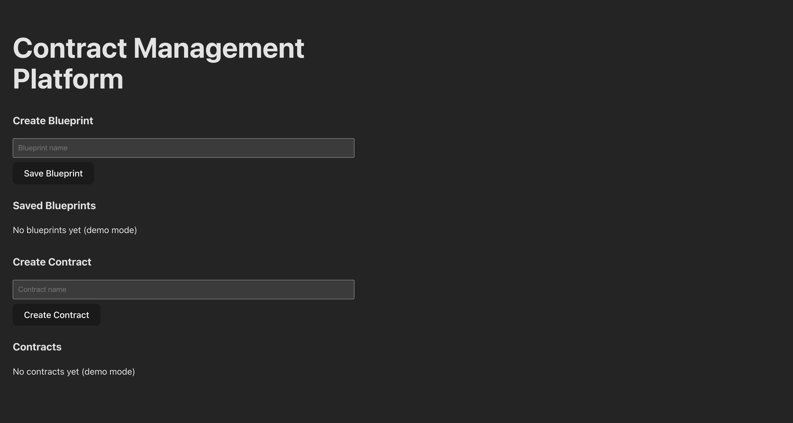
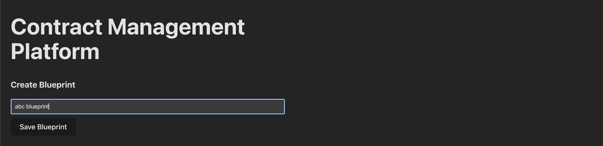
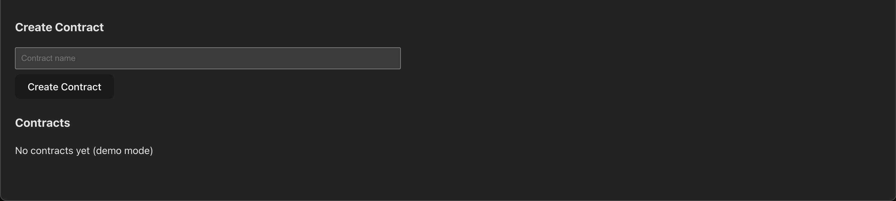

# Contract Management Platform (Frontend)

## Overview
This is a frontend-only Contract Management Platform built as part of an assignment.

The application allows users to:
- Create contract blueprints
- View saved blueprints
- Create contracts using blueprints
- View a list of created contracts
- 
All functionality is implemented in demo mode without a backend, as required.

*******************************************************************************************************************************************************************

## Features
- Create Blueprint (demo mode)
- View Saved Blueprints
- Create Contract
- View Contracts List
- Clean and simple UI

*******************************************************************************************************************************************************************

## Tech Stack
- React
- TypeScript
- Vite
  
*******************************************************************************************************************************************************************

## Screenshots

### Home Screen


### Create Blueprint


### Contracts List


*******************************************************************************************************************************************************************

## Project Structure
src/
├─ components/
│ ├─ Blueprint/
│ └─ Contract/
├─ App.tsx
├─ main.tsx
*******************************************************************************************************************************************************************

## How to Run Locally
```bash
npm install
npm run dev

